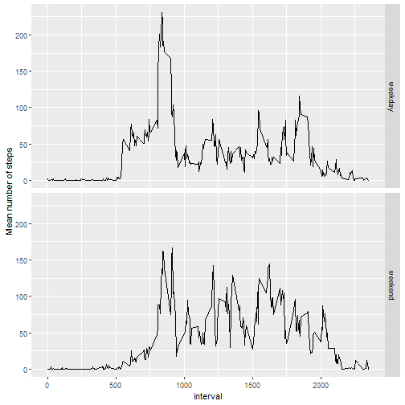

## R Markdown

This is an R Markdown document. Markdown is a simple formatting syntax for authoring HTML, PDF, and MS Word documents. For more details on using R Markdown see <http://rmarkdown.rstudio.com>.

When you click the **Knit** button a document will be generated that includes both content as well as the output of any embedded R code chunks within the document. You can embed an R code chunk like this - it loads the raw data and performs the suitable processing and transformation needed for the analysis:
1. Loading and preprocessing the data;
2. Calculating the mean total number of steps taken per day;
3. Identifying the the average daily activity pattern;
4. Devise a strategy to fill missing data;
5. Compare the average number of steps per interval during weekdays and weekends.


```r
library(knitr)
library(ggplot2)
library(plyr)

setwd("~/Coursera/ReproducibleResearch/RepData_PeerAssessment1/")
#read data from "activity.csv"
inputdata<-read.csv("activity.csv")

#compute total steps per day.  
totalstepsdaily<-with(inputdata,tapply(steps,date,FUN = sum,is.na=FALSE))
#Compute the mean and median of the total steps per day
meanstepsdaily<-mean(totalstepsdaily[is.na(totalstepsdaily)==FALSE])
medianstepsdaily<-median(totalstepsdaily[is.na(totalstepsdaily)==FALSE])

# Average steps per interval
stepsperinterval<-with(inputdata[is.na(inputdata$steps)==FALSE,],tapply(steps,interval,FUN = mean,is.na=FALSE))
# max number of steps observed in a single interval
subsetmax<-stepsperinterval[stepsperinterval==max(stepsperinterval)]

#Calculate and report the total number of missing values in the dataset (i.e. the total number of rows with NA NAs)
total.missing.data<-sum(is.na(inputdata$steps)==TRUE) 

#Devise a strategy for filling in all of the missing values in the dataset. In this case we choose to replace missing values with the mean of steps for the relevant interval.
inputdata2 <- inputdata
for (i in 1:dim(inputdata)[1]){
  if (is.na(inputdata[i,1])){
    inputdata2[i,1] <- stepsperinterval[as.character(inputdata[i,3])]
  }
}

#compute total steps per day.  
totalstepsdailywithfill<-with(inputdata2,tapply(steps,date,FUN = sum,is.na=FALSE))

inputdata2$date <- as.Date(inputdata2$date) # transform to a date
#add a new variable which contains the weekdays and rename
inputdata2[,4] <- as.factor(weekdays(inputdata2$date))
colnames(inputdata2)[4]="typeofday"
#rename the levels depending on whether it is a weekday or a weekend.
levels(inputdata2$typeofday) <- c("weekday","weekday","weekend","weekend","weekday","weekday","weekday")

#use the ddply function from plyr to create a summary of the mean number of steps based on the "typeofday" and "interval" variables.
cdata <- ddply(inputdata2, c("typeofday", "interval"), summarise,  mean = mean(steps))
```

## Processed data results

**1) Histogram**

Here is the code used to generate a  histogram of the total steps taken per day:

```r
hist(totalstepsdaily,main = "Histogram of total daily steps" ,xlab="Total daily steps",breaks=40,ylim = c(0,12))
abline(h=7,col="red",lty=2)
```


The mean and median of the total number of steps taken per day are 1.0766189 &times; 10<sup>4</sup> and 10765 respectively.


**2) Time Series Plot**

Here is the code used to generate a plot of the average number of steps calculated across 5-minute intervals.  The averaging is taken across all days.


```r
plot(as.integer(names(stepsperinterval)),stepsperinterval,type="l",main = "Average number of steps per 5-minute interval",xlab="Start time of the 5-minute interval (in minutes)",ylab = "Average number of steps")
```


The 5-minute interval, starting 835  minutes into the day, is when the maximum number of steps (206) is observed. 


**3) Impact of imputing missing data**

We have filled the missing steps data with the average step count per 5-minute interval computed using available data.

Here is the code used to generate a  histogram of the total steps taken per day:

```r
hist(totalstepsdailywithfill,main = "Histogram of total daily steps - missing data replaced" ,xlab="Total daily steps",breaks=40,ylim = c(0,12))
abline(h=7,col="red",lty=2)
```


The mean and median of the total number of steps taken per day using modified dataset are now equal at 1.0766189 &times; 10<sup>4</sup>. A horozontal line has been added to both this histogram and the earlier histogram shown in section 1 above to help make clear how the filling action has modified the original dataset.  We see that the charts are identical apart from one bucket (corresponding to the mean of the total daily steps).

Note that the `echo = FALSE` parameter can be added to code chunks if you want to  prevent printing of the R code when the file is knitted.

**4) Comparing data from weekends to weekdays**

Here is the code used to generate a panel plot containing a time series plot of the 5-minute interval (x-axis) and the average number of steps taken, averaged across all weekday days or weekend days (y-axis). 


```r
ggplot(data = cdata , aes(x = interval,y=mean)) +  geom_line() +facet_grid(typeofday~.) +ylab("Mean number of steps") 
```




